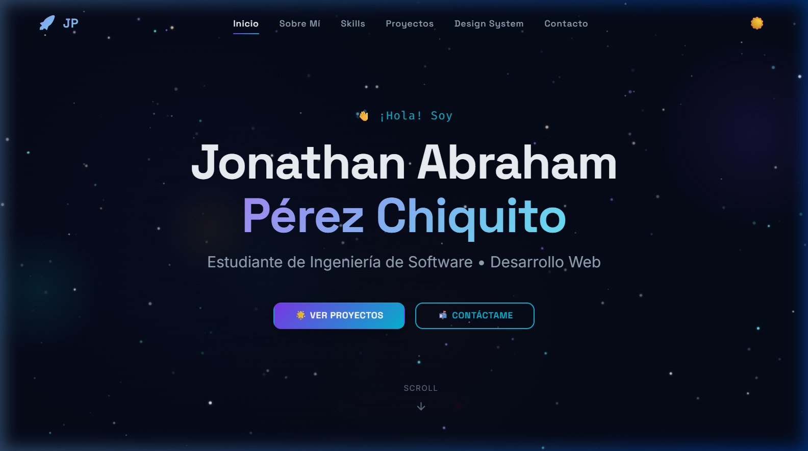
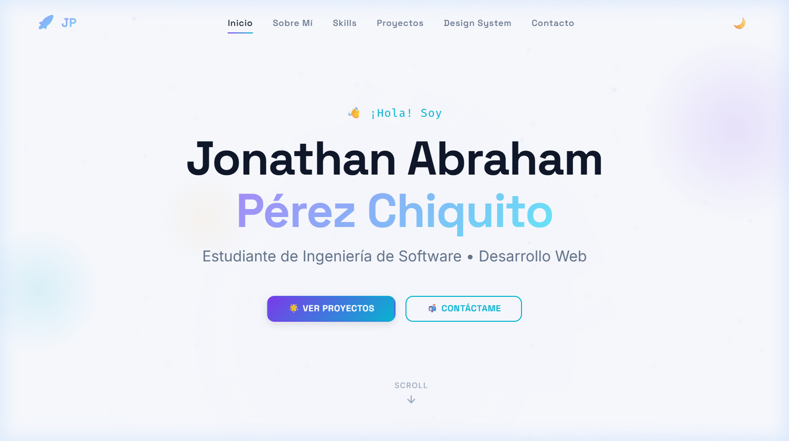
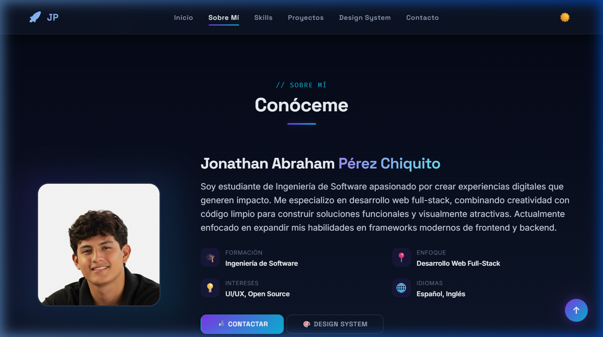
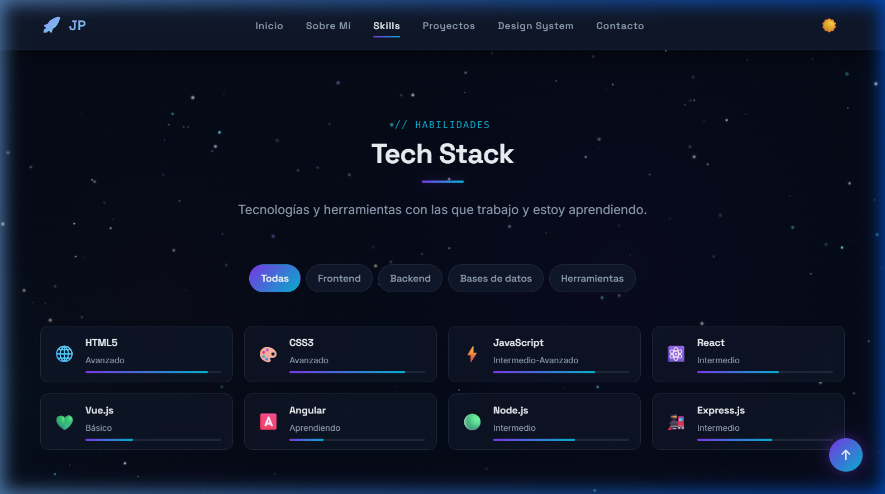
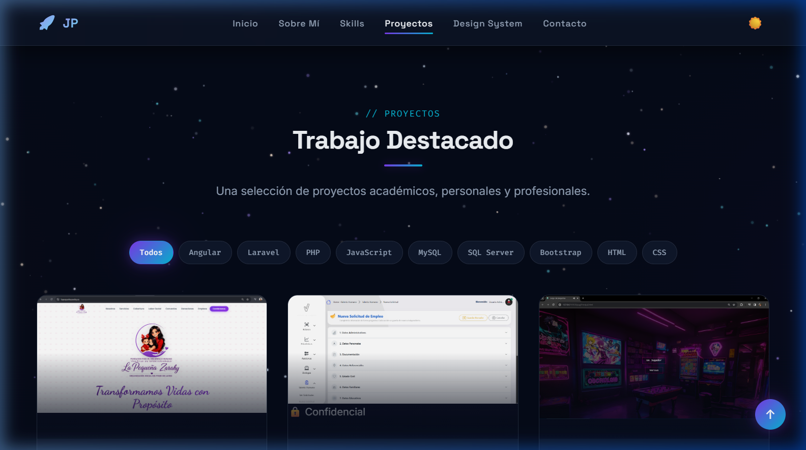
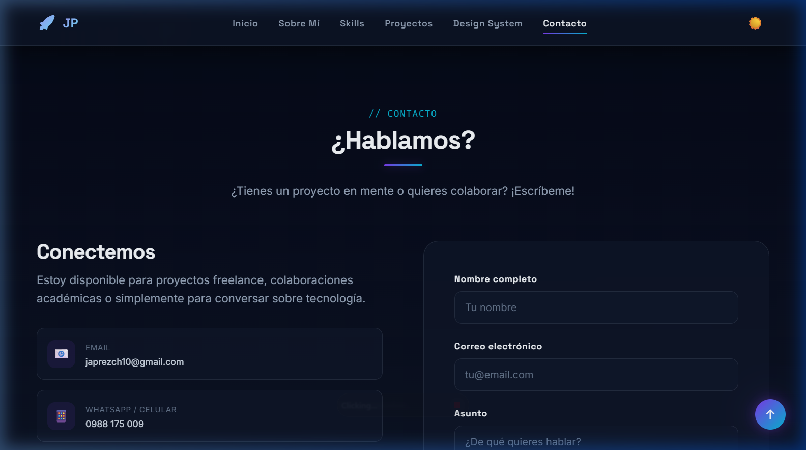

# 🌌 Portafolio — Jonathan Abraham Pérez Chiquito

Portafolio personal de desarrollo de software construido como sitio web estático con un diseño premium, modo oscuro/claro, animaciones fluidas y un campo de estrellas interactivo de fondo.

<p align="center">
  
</p>

---

## 📋 Descripción

Sitio web tipo **Single Page Application** (SPA estática) que presenta mi perfil profesional, habilidades técnicas, proyectos destacados e información de contacto. Diseñado con un enfoque visual moderno que incluye:

- **Modo oscuro y claro** con transición suave y persistencia en `localStorage`.
- **Campo de estrellas animado** en canvas como fondo inmersivo.
- **Animaciones de scroll** con Intersection Observer para revelación progresiva de secciones.
- **Filtros interactivos** tanto para habilidades (por categoría) como para proyectos (por tecnología).
- **Modal de detalles** para cada proyecto con galería de imágenes y descripción extendida.
- **Formulario de contacto** con validación en tiempo real.
- **Diseño 100% responsivo** adaptado a desktop, tablet y móvil.

---

## 🛠️ Tecnologías

| Categoría | Tecnologías |
|-----------|-------------|
| **Estructura** | HTML5 semántico |
| **Estilos** | CSS3 vanilla (variables CSS, grid, flexbox, glassmorphism, gradientes) |
| **Lógica** | JavaScript ES6+ (clases, módulos, Intersection Observer, Canvas API) |
| **Diseño** | Sistema de diseño propio con tokens (colores, tipografía, espaciado, sombras) |
| **Tipografía** | [Inter](https://fonts.google.com/specimen/Inter), [JetBrains Mono](https://fonts.google.com/specimen/JetBrains+Mono) (Google Fonts) |
| **Iconos** | Emojis nativos Unicode |

> **Sin frameworks ni dependencias externas.** Todo el código es vanilla HTML, CSS y JavaScript.

---

## 📁 Estructura del Proyecto

```
portfolio/
├── index.html                 # Página principal
├── design-system.html         # Guía del sistema de diseño
├── README.md
├── assets/
│   └── images/                # Imágenes de proyectos y avatar
├── css/
│   ├── variables.css          # Tokens de diseño y modo claro/oscuro
│   ├── base.css               # Reset y estilos base
│   ├── layout.css             # Contenedor y estructura general
│   ├── components.css         # Botones, tarjetas, badges, modales, filtros
│   ├── sections.css           # Estilos por sección (hero, about, skills, projects, contact)
│   ├── animations.css         # Keyframes y transiciones
│   ├── responsive.css         # Media queries (1024px, 768px, 480px)
│   └── design-system.css      # Estilos exclusivos de la guía de diseño
├── js/
│   ├── main.js                # Controlador principal (inicialización)
│   ├── stars.js               # Campo de estrellas en canvas
│   ├── theme.js               # Gestión del tema oscuro/claro
│   ├── navigation.js          # Navbar, scroll suave, menú móvil
│   ├── filters.js             # Filtros de proyectos y habilidades
│   ├── modal.js               # Modal de detalles de proyecto y repo privado
│   ├── form.js                # Validación del formulario de contacto
│   └── animations.js          # Intersection Observer para animaciones de scroll
└── screenshots/               # Capturas de pantalla
```

---

## 🚀 Instrucciones de Visualización

### Opción 1: Servidor local con Python

```bash
# Clonar el repositorio
git clone https://github.com/JonaPerezSoftware/Portafolio-Jonathan-Perez.git
cd Portafolio-Jonathan-Perez

# Iniciar servidor local
python -m http.server 8080
```

Luego abrir en el navegador: **[http://localhost:8080](http://localhost:8080)**

### Opción 2: Servidor local con Node.js

```bash
# Instalar un servidor estático
npx -y serve .
```

### Opción 3: Abrir directamente

Simplemente abre el archivo `index.html` en tu navegador. Algunas funcionalidades como las fuentes de Google pueden requerir conexión a internet.

### Opción 4: Live Server (VS Code)

Si usas Visual Studio Code, instala la extensión **Live Server** y haz clic derecho sobre `index.html` → **"Open with Live Server"**.

---

## 📸 Capturas de Pantalla

### 🌑 Modo Oscuro — Hero

<p align="center">
  
</p>

### 🌕 Modo Claro — Hero

<p align="center">
  
</p>

### 👤 Sobre Mí

<p align="center">
  
</p>

### 💡 Habilidades / Tech Stack

<p align="center">
  
</p>

### 🚀 Proyectos

<p align="center">
  
</p>

### 📬 Contacto

<p align="center">
  
</p>

---

## ✨ Características Destacadas

- 🌗 **Modo oscuro / claro** con transición animada y persistencia en localStorage
- ✨ **Campo de estrellas** interactivo animado en Canvas
- 🎯 **Filtros por categoría** en habilidades (Frontend, Backend, Bases de datos, Herramientas)
- 🔎 **Filtros por tecnología** en proyectos (Angular, Laravel, PHP, JavaScript, MySQL, SQL Server, Bootstrap, HTML, CSS)
- 📱 **Diseño responsivo** adaptado a desktop, tablet y móvil
- 🖼️ **Galería de imágenes** en el modal de detalles de proyecto
- 🔒 **Aviso de repositorio privado** para proyectos empresariales con código confidencial
- 📊 **Barras de nivel** animadas en las habilidades
- 🎨 **Glassmorphism** y efectos de gradiente cósmico
- ♿ **Accesibilidad** con roles ARIA, `aria-selected`, navegación por teclado

---

## 👤 Autor

**Jonathan Abraham Pérez Chiquito**

- 💼 Ingeniería en Software
- 📧 Contacto disponible en el portafolio
- 📱 WhatsApp: [0988 175 009](https://wa.me/593988175009)
- 🐙 GitHub: [@JonaPerezSoftware](https://github.com/JonaPerezSoftware)

---

## 📄 Licencia

Este proyecto es de uso personal y académico. Todos los derechos reservados © 2026 Jonathan Pérez.
